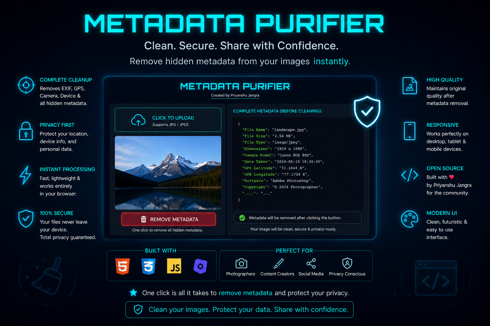

# Metadata-Purifier
Image Metadata Purifier A lightweight tool that strips sensitive metadata from images—EXIF data, GPS coordinates, camera info, and personal identifiers—protecting your privacy before sharing photos online.  Problem Digital images contain hidden metadata (EXIF) that can expose:  Exact location (GPS coordinates) Device info (camera model, settings) .

---

### 🎨 Interface Preview

  

---

### 🔍 How It Works

1. **Upload** your image  
2. **Inspect** hidden metadata  
3. **Clean** & **Download**

---

## 📚 Understanding Metadata & Its Importance

### 🔎 What is Metadata?

Metadata is **"data about data."** It is hidden information embedded within digital files—specifically images—that describes the file but is not visible in the picture itself. Think of it as a digital fingerprint or an invisible sticker attached to your photo.

When you take a photo with a smartphone or digital camera, the device automatically embeds a wealth of information into the file. This includes:

*   **EXIF (Exchangeable Image File Format):** Camera settings, aperture, shutter speed, ISO.
*   **GPS (Global Positioning System):** Exact Latitude & Longitude where the photo was taken.
*   **TIFF (Tagged Image File Format):** Device details, software used.
*   **XMP & IPTC:** Copyright info, author details, editing history.

---

### 🌍 Why is Metadata Important?

#### **For Privacy & Security:**
Every time you upload a photo to social media, email, or messaging apps, the metadata travels with it. This seemingly harmless hidden data can reveal:

*   📍 **Your Home Address** (via GPS coordinates)
*   📅 **Your Daily Routine** (timestamps)
*   📱 **Your Device Model** (camera serial numbers)
*   🖥️ **Your Software Version** (editing history)
*   🏢 **Your Workplace** (photos taken inside office premises)

#### **For Cyber Crime Investigators:**
Metadata is a powerful **digital forensics** tool. Investigators can:

*   Trace the origin of threatening or anonymous images
*   Verify the authenticity of evidence in legal cases
*   Track the location of a suspect at a specific time
*   Identify the device used to capture evidence
*   Establish timelines for digital alibis

#### **For Security Researchers:**
Analyzing metadata helps in:

*   **Threat Intelligence:** Identifying malware distribution patterns
*   **Phishing Detection:** Spotting fake documents
*   **OSINT (Open Source Intelligence):** Gathering info about targets

---
## 🛠️ Tech Stack

<table>
    <tr>
        <td valign="center" width="100">
            
        </td>
        <td valign="center">
            <b>HTML5</b> - Structure & Semantics
        </td>
        <td valign="center" width="100">
            
        </td>
        <td valign="center">
            <b>CSS3</b> - Styling & Animations
        </td>
    </tr>
    <tr>
        <td valign="center" width="100">
            
        </td>
        <td valign="center">
            <b>JavaScript (ES6+)</b> - Core Logic
        </td>
        <td valign="center" width="100">
            
        </td>
        <td valign="center">
            <b>Orbitron & Roboto</b> - Typography
        </td>
    </tr>
</table>

### 🕵️ What Can Be Found Using Metadata Analysis?

Metadata analysis can reveal a shocking amount of personal and investigative information

🛡️ How Metadata purifier Helps

Metadata purifier is a privacy-first tool designed to bridge the gap between technical forensics and user privacy.

✅ 1. For Privacy Advocates:
Remove hidden tracking data before sharing images online
Prevent location tracking by stripping GPS tags
Maintain anonymity on anonymous posting platforms

✅ 2. For Cyber Crime Investigators & Forensics:
Inspect EXIF/GPS data to verify evidence authenticity
Generate file hashes (SHA-256, MD5) to prove file integrity
Understand what data their own images are leaking

✅ 3. For Security Researchers:
Analyze metadata leakage in OSINT missions
Test organizational data leakage policies
Educate teams about operational security (OPSEC)

⚠️ Educational Disclaimer
⚠️ IMPORTANT NOTICE

This tool is developed and provided SOLELY FOR EDUCATIONAL PURPOSES.

Intended Use: To help individuals, researchers, and investigators understand, visualize, and remove metadata from their own images for privacy and verification.
Prohibited Use: This tool must NOT be used to:
Stalk, harass, or deanonymize others without consent
Tamper with evidence in legal investigations
Conduct illegal surveillance or espionage
Infringe upon the privacy of others
By using this tool, you agree to use it responsibly and ethically. The creator assumes no liability for misuse of this software. Always obtain proper legal consent before analyzing metadata belonging to others.

🧑‍⚖️ Legal Compliance
This tool respects international privacy laws:

GDPR (Europe): Helps users exercise their "Right to be Forgotten" by removing identifiers
CCPA (California): Aids in data minimization practices
IT Act (India): Aligns with cybersecurity guidelines for data protection
🔐 Stay Safe, Stay Invisible
"In the digital world, the ghost in the machine is the metadata."
